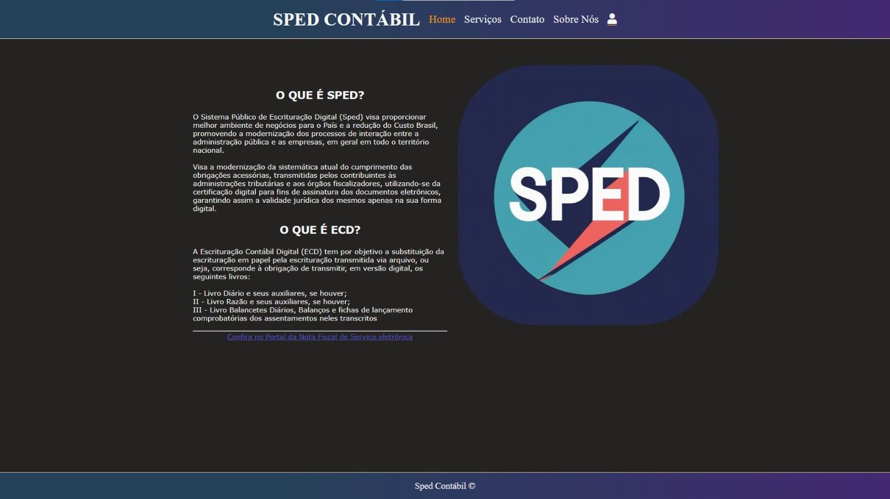

# 📊 Sistema de Análise SPED Contábil — ECD


Sistema web desenvolvido para análise, visualização e validação de arquivos do SPED Contábil (ECD), permitindo interpretação estruturada de registros fiscais e contábeis.

---

# 🚀 Funcionalidades

✔ Upload de arquivos SPED Contábil  
✔ Leitura automatizada dos registros ECD  
✔ Visualização estruturada dos dados  
✔ Interface intuitiva e responsiva  
✔ Separação por tabelas oficiais do manual ECD  
✔ Interpretação de registros contábeis  
✔ Organização fiscal dos dados  
✔ Sistema baseado em regras contábeis

---

# 🖥 Preview

## Tela Principal



---

# 🛠 Tecnologias Utilizadas

- PHP
- MySQL
- HTML5
- CSS3
- JavaScript
- Bootstrap

---

# 📂 Estrutura do Projeto

```bash
sistema-sped-contabil/
│
├── assets/
├── css/
├── js/
├── php/
├── bancos/
│
├── index.php
└── README.md
```

---

# ⚙ Como Executar o Projeto

## 1. Clone o repositório

```bash
git clone https://github.com/SEU-USUARIO/sistema-sped-contabil.git
```

---

## 2. Acesse a pasta

```bash
cd sistema-sped-contabil
```

---

## 3. Configure o banco de dados

Importe o arquivo:

```bash
database/banco.sql
```

---

## 4. Execute no servidor local

Recomendado:

- XAMPP
- Laragon
- WampServer

---

# 📚 Objetivo do Projeto

Este projeto foi desenvolvido com foco em:

- prática de desenvolvimento web
- manipulação de arquivos fiscais
- interpretação de dados estruturados
- organização de sistemas contábeis
- experiência com PHP e MySQL

---

# 💡 Aprendizados

Durante o desenvolvimento deste sistema foram trabalhados conceitos como:

- Estruturação de sistemas web
- Manipulação de dados
- Responsividade
- Organização de código
- Integração front-end e back-end
- Validação de informações

---

# 📌 Melhorias Futuras

- Exportação em PDF
- Dashboard analítico
- Sistema de autenticação
- Relatórios avançados
- Integração com APIs
- Upload múltiplo

---

# 👨‍💻 Autor

Matheus Araujo da Silva

- Site/Portifólio: https://matheus-araujo.net.br
- GitHub: https://github.com/matheusaraujo019
- LinkedIn: https://www.linkedin.com/in/matheus-araujo-da-silva-9a082b388/

---

# 📄 Licença

Este projeto está sob a licença MIT.
